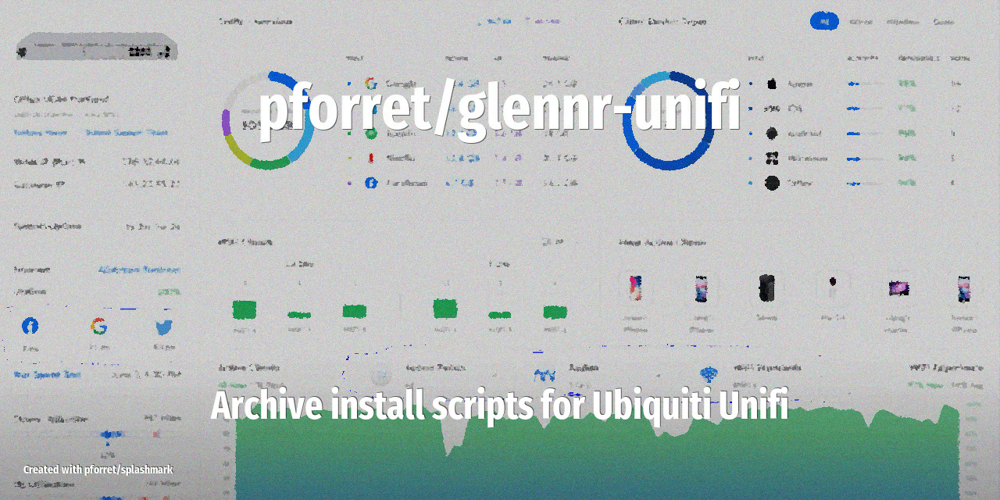

[](https://github.com/pforret/glennr-unifi/actions/workflows/daily.yml)


# glennr-unifi



UNIFI NETWORK APPLICATION SCRIPTS

* This is a mirror/backup of the Ubiquiti install scripts from [glennr.nl/scripts](https://glennr.nl/scripts)
* they are used to install the Ubiquiti Network Controller on a Raspberry Pi or Ubuntu server
* check the full procedure on [community.ui.com](https://community.ui.com/questions/UniFi-Installation-Scripts-or-UniFi-Easy-Update-Script-or-UniFi-Lets-Encrypt-or-UniFi-Easy-Encrypt-/ccbc7530-dd61-40a7-82ec-22b17f027776)

## IMPORTANT

These scripts are/were **not created by me**, they are developed by [Glenn Rietveld](https://www.linkedin.com/in/glenn-rietveld-555811149) from [Ubiquiti](https://www.ui.com/). I've only created this repository to make it easier to find the scripts and track their updates.

## Usage

```bash
Program : glennr-unifi.sh  by peter@forret.com
Version : v0.1.11 (May 19 15:23:54 2024)
Purpose : sync all scripts from glennr.nl
Usage   : glennr-unifi.sh [-h] [-Q] [-V] [-F] [-L <LOG_DIR>] [-T <TMP_DIR>] <action>
Flags, options and parameters:
-h|--help        : [flag] show usage [default: off]
-Q|--QUIET       : [flag] no output [default: off]
-V|--VERBOSE     : [flag] also show debug messages [default: off]
-F|--FORCE       : [flag] do not ask for confirmation (always yes) [default: off]
-L|--LOG_DIR <?> : [option] folder for log files   [default: /Users/pforret/log/glennr-unifi]
-T|--TMP_DIR <?> : [option] folder for temp files  [default: /tmp/glennr-unifi]
<action>         : [choice] action to perform  [options: get,check,env,update]

### TIPS & EXAMPLES
* use glennr-unifi get to get all Unifi scripts from glennr.nl
  glennr-unifi get
* use glennr-unifi check to check if this script is ready to execute and what values the options/flags are
  glennr-unifi check
* use glennr-unifi env to generate an example .env file
  glennr-unifi env > .env
* use glennr-unifi update to update to the latest version
  glennr-unifi update
* >>> bash script created with pforret/bashew
* >>> for bash development, also check out pforret/setver and pforret/progressbar
```
